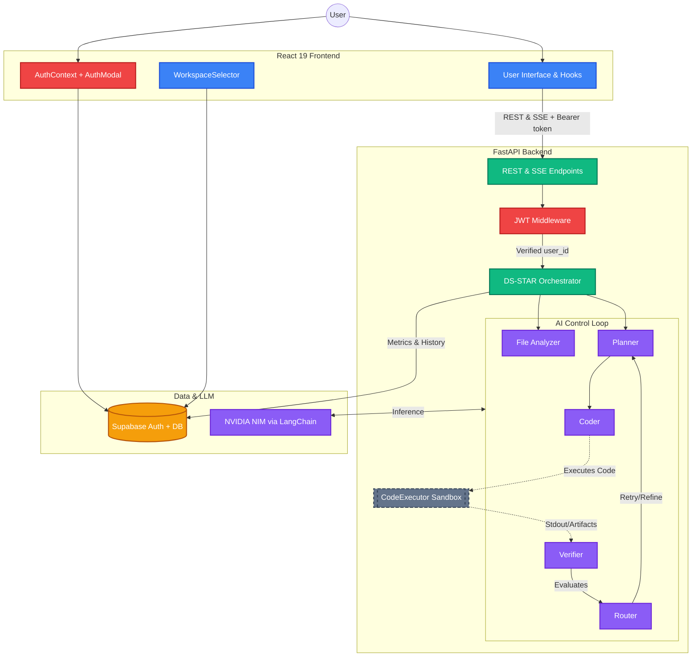

# Agentloop — DS-STAR Agent Platform

> **Intelligent Document Processing (IDP) & Deep Research Platform** powered by the DS-STAR Agent Workflow.
> Agentloop autonomously interprets, plans, codes, executes, and verifies complex data operations — secured by Supabase JWT authentication.


---

## 📖 Overview

Agentloop is a multi-agent AI platform built for Intelligent Document Processing. By leveraging the **DS-STAR Framework** (Data Science - Self-Taught Agent with Reasoning), the platform dynamically analyzes datasets, generates Python code to process them, executes the code in a secure sandbox, and self-verifies the output against user constraints.

**DS-STAR+** extends the core loop with a deep research mode that decomposes open-ended queries into parallel sub-questions, runs each as an independent DS-STAR agent, and synthesizes a comprehensive research report.

---

## ✨ Key Features

- **Autonomous Agent Loop**: Plan → Code → Execute → Verify → Route.
- **Deep Research Mode (DS-STAR+)**: Decompose → Parallelize → Synthesize for open-ended queries.
- **Supabase JWT Authentication**: Secure sign-up/sign-in; every API call is auth-gated.
- **Workspace Management**: Organize runs into user-owned workspaces with RLS-enforced isolation.
- **Secure Sandboxing**: Executes AI-generated code in isolated subprocesses (Docker-ready).
- **Real-Time Streaming**: Live agent states and execution artifacts via Server-Sent Events (SSE).
- **Persistent Analytics**: Run history, metrics, and observability via Supabase PostgreSQL.
- **Modern UI**: Glassmorphism design on React 19 + Tailwind CSS; workspace selector, auth modal.

---

## 🏗️ System Architecture



---

## 💻 Tech Stack

| Layer | Technology |
|---|---|
| **Frontend** | React 19, Vite, Tailwind CSS, Lucide React |
| **State / Auth** | Zustand, `@supabase/supabase-js` |
| **Backend** | FastAPI, Python 3.10+, PyJWT, Tenacity |
| **AI / LLM** | LangChain, NVIDIA NIM |
| **Execution** | Subprocess sandbox (Docker-ready) |
| **Database / Auth** | Supabase (PostgreSQL + Row-Level Security) |

---

## 📁 Project Structure

```text
Agentloop/
├── backend/
│   ├── api/
│   │   ├── controllers/       # Business logic controllers
│   │   └── routes.py          # FastAPI router — thin endpoint declarations
│   ├── core/                  # DS-STAR Orchestrator, Planner, Coder, Verifier…
│   ├── db/
│   │   ├── create_workspaces.sql      # Workspaces table + RLS
│   │   ├── create_agent_runs.sql      # Agent runs table + RLS
│   │   ├── create_reports_schema.sql  # Reports + sub_questions tables + RLS
│   │   └── create_eval_schema.sql     # Evaluation metrics schema
│   ├── eval/                  # Evaluation framework and metrics
│   ├── middleware/
│   │   ├── auth.py            # JWT dependency (get_current_user / get_optional_user)
│   │   └── error_handler.py   # Global exception handler
│   ├── models/                # Pydantic request/response schemas
│   ├── services/
│   │   └── supabase_service.py  # Supabase client + all DB/Storage ops
│   ├── tests/
│   │   ├── test_auth_middleware.py    # Unit tests for JWT auth
│   │   ├── test_code_executor.py
│   │   ├── test_orchestrator_integration.py
│   │   ├── test_router_agent.py
│   │   └── test_verifier_agent.py
│   ├── main.py                # FastAPI entry point
│   ├── requirements.txt
│   ├── .env                   # Local secrets (git-ignored)
│   └── .env.example           # Template — copy to .env
├── src/
│   ├── components/
│   │   ├── agent/             # AgentProgressPanel, HistoryPanel, AgentSettings
│   │   ├── shared/
│   │   │   ├── AuthModal.jsx        # Login / Sign-Up modal
│   │   │   ├── WorkspaceSelector.jsx # Workspace dropdown
│   │   │   ├── ConfirmDialog.jsx
│   │   │   └── Toast.jsx
│   │   └── upload/
│   │       └── FileUploadPanel.jsx  # Drag-drop zone with WorkspaceSelector
│   ├── contexts/
│   │   └── AuthContext.jsx    # AuthProvider + useAuth() hook
│   ├── hooks/
│   │   ├── useAgentRun.js     # DS-STAR live run state + history
│   │   └── useFileUpload.js   # File lifecycle: add, upload, process, clear
│   ├── lib/
│   │   └── supabaseClient.js  # Singleton Supabase browser client
│   ├── pages/
│   │   ├── HomePage.jsx       # Main layout: Upload | Query | Agent output
│   │   └── EvalDashboard.jsx  # Evaluation metrics dashboard
│   ├── services/
│   │   ├── api.js             # REST API calls (upload, process, clear) + auth headers
│   │   └── agentApi.js        # SSE streaming client + auth header
│   ├── stores/
│   │   └── workspaceStore.js  # Zustand store for active workspace
│   ├── types/
│   │   └── index.js           # JSDoc typedefs (User, Session, Workspace, AgentRun…)
│   ├── App.jsx                # Root: AuthProvider + Router
│   └── main.jsx               # React DOM entry
├── public/                    # Static assets
├── .env                       # Frontend env vars (VITE_SUPABASE_*)
├── .env.example               # Frontend env template
├── vite.config.js             # Dev server + /api proxy → localhost:8000
├── package.json               # Node dependencies
└── docs/                      # Agent architecture documentation
```

---

## 🔐 Authentication & Security

Agentloop uses **Supabase JWT authentication** end-to-end:

1. **Frontend**: `@supabase/supabase-js` manages sign-in/sign-up, token refresh, and session persistence.
2. **API calls**: Every request stamped with `Authorization: Bearer <access_token>` via `authHeader()` helpers in `api.js` and `agentApi.js`.
3. **Backend**: `get_current_user` FastAPI dependency decodes and verifies the JWT using `PyJWT` + `SUPABASE_JWT_SECRET`. Returns `AuthUser(user_id, email, role)`.
4. **Database**: Supabase Row-Level Security policies enforce `auth.uid() = user_id` — users can only access their own rows.

### Protected endpoints
| Method | Path | Auth |
|---|---|---|
| `POST` | `/api/upload` | Optional (anonymous uploads allowed) |
| `POST` | `/api/process` | Optional |
| `POST` | `/api/agent/run` | Optional (user_id stamped when present) |
| `GET` | `/api/agent/runs` | Optional (scoped to user when authenticated) |
| `GET` | `/api/agent/runs/{id}` | Optional |
| `GET` | `/api/workspaces` | **Required** |
| `POST` | `/api/workspaces` | **Required** |

---

## 🤖 Agent Workflow

Agentloop relies on the **DS-STAR Orchestrator** pattern:

1. **[File Analyzer](docs/file_analyzer_agent.md)**: Normalizes incoming unstructured data into context schemas.
2. **[Retriever](docs/retriever.md)**: Filters large documents using local `sentence-transformers`.
3. **[Planner](docs/planner_agent.md)**: Transforms user intent into a mutable multi-step plan.
4. **[Coder](docs/coder_agent.md)**: Translates each plan step into self-contained Python code.
5. **[Code Executor](docs/code_executor.md)**: Runs generated code in an isolated sandbox.
6. **[Debugger](docs/debugger_agent.md)**: Surgically corrects failing code blocks.
7. **[Verifier](docs/verifier_agent.md) & [Router](docs/router_agent.md)**: Evaluate output and re-route for retries.
8. **[Finalizer](docs/finalizer_agent.md)**: Converts execution output into clean Markdown insights.

**DS-STAR+** extends with:
- **[SubQuestionGenerator](docs/subquestion_generator_agent.md)**: Decomposes open-ended queries into sub-questions.
- **[ReportWriter](docs/report_writer_agent.md)**: Synthesizes parallel sub-runs into a research report.

---

## 🚀 Quick Start

### Prerequisites
- Node.js 18+
- Python 3.10+
- Supabase project (free tier works)
- NVIDIA NIM API key

### 1. Clone & configure

```bash
git clone <repo-url>
cd Agentloop
```

### 2. Supabase setup

1. Create a project at [supabase.com](https://supabase.com).
2. Open the **SQL Editor** and run these migration files **in order**:
   ```
   backend/db/create_workspaces.sql
   backend/db/create_agent_runs.sql
   backend/db/create_reports_schema.sql
   backend/db/create_eval_schema.sql
   ```
3. From **Settings → API**, collect:
   - `Project URL` → `SUPABASE_URL` / `VITE_SUPABASE_URL`
   - `anon public` key → `VITE_SUPABASE_ANON_KEY`
   - `service_role` or `anon` key → `SUPABASE_PUBLISHABLE_KEY`
   - `JWT Secret` (Settings → API → JWT Settings) → `SUPABASE_JWT_SECRET`

### 3. Backend setup

```bash
cd backend
python -m venv venv
# Windows:
venv\Scripts\activate
# macOS/Linux:
source venv/bin/activate

pip install -r requirements.txt

# Copy template and fill in your keys
cp .env.example .env
# Edit .env: set SUPABASE_URL, SUPABASE_PUBLISHABLE_KEY, SUPABASE_JWT_SECRET, NVIDIA_API_KEY

uvicorn main:app --reload
# API running at http://localhost:8000
```

### 4. Frontend setup

```bash
# From project root
cp .env.example .env       # if .env doesn't exist
# Edit .env: set VITE_SUPABASE_URL and VITE_SUPABASE_ANON_KEY

npm install
npm run dev
# App running at http://localhost:5173
```

> **Note**: The Vite dev server proxies `/api/*` → `http://localhost:8000` automatically — no CORS configuration needed during development.

### 5. Run backend tests

```bash
cd backend
python -m pytest tests/ -v
```

---

## 🔌 API Reference

| Method | Path | Auth | Description |
|---|---|---|---|
| `POST` | `/api/upload` | Optional | Upload files to session-scoped cache |
| `POST` | `/api/process` | Optional | Build in-memory document context |
| `POST` | `/api/agent/run` | Optional | Start DS-STAR agent run (SSE stream) |
| `GET` | `/api/agent/runs` | Optional | List past runs (scoped to user) |
| `GET` | `/api/agent/runs/{id}` | Optional | Get a single run by ID |
| `GET` | `/api/workspaces` | **Required** | List authenticated user's workspaces |
| `POST` | `/api/workspaces` | **Required** | Create a new workspace |
| `DELETE` | `/api/clear` | Optional | Wipe session file cache |
| `GET` | `/api/eval/*` | Public | Evaluation metrics endpoints |

---

## 🤝 Contributing

1. Fork the repository.
2. Create a feature branch: `git checkout -b feature/amazing-feature`
3. Commit changes: `git commit -m 'feat: add amazing feature'`
4. Push: `git push origin feature/amazing-feature`
5. Open a Pull Request.

---

## 📄 License

MIT License — see [LICENSE](LICENSE) for details.
