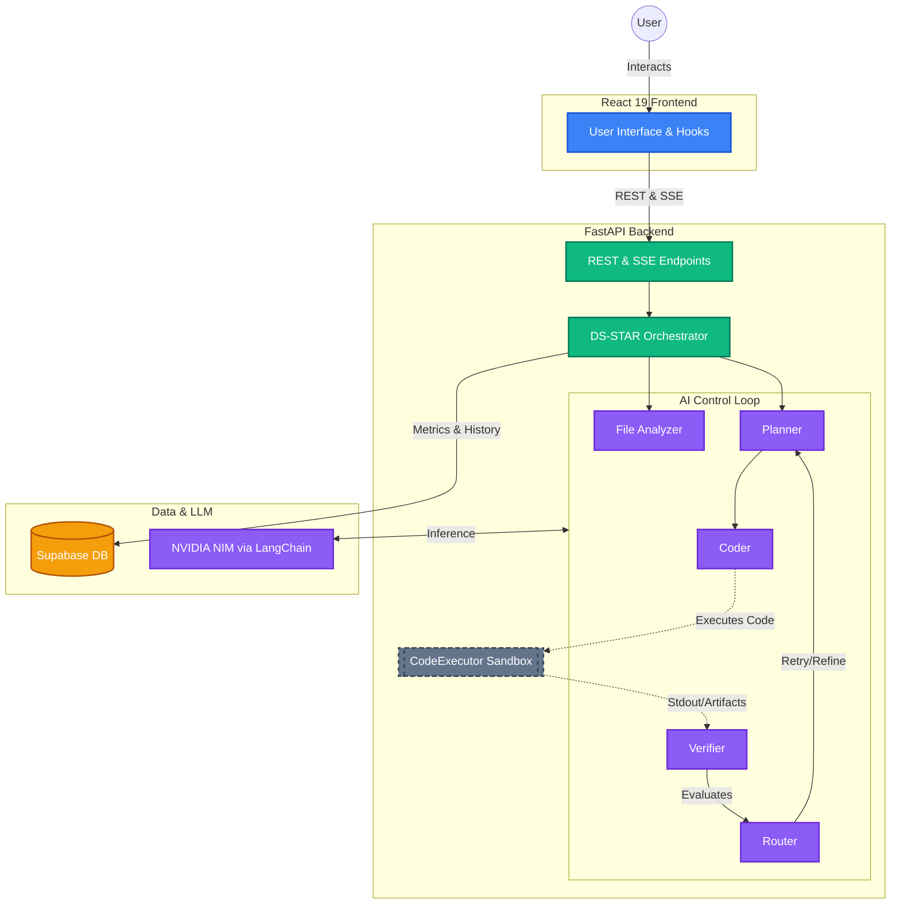

# LoopMind

> **Intelligent Document Processing (IDP) Platform** powered by the DS-STAR Agent Workflow.
> LoopMind autonomously interprets, plans, codes, executes, and verifies complex data operations.


## 📖 Overview

LoopMind is a multi-agent AI platform built for Intelligent Document Processing. By leveraging the **DS-STAR Framework** (Data Science - Self-Taught Agent with Reasoning), the platform dynamically analyzes datasets, generates Python code to process them, executes the code in a secure sandbox, and self-verifies the output against user constraints.

## ✨ Key Features

- **Autonomous Agent Loop**: Plan → Code → Execute → Verify → Route.
- **Secure Sandboxing**: Executes AI-generated code securely within isolated Docker containers.
- **Real-Time Streaming**: Live streaming of agent states, execution progress, and execution artifacts using Server-Sent Events (SSE).
- **Persistent Analytics**: Comprehensive run histories, telemetry, and observability metrics via Supabase.
- **Modern UI**: Polished, highly responsive UI built on React 19 and Tailwind CSS.
- **Multi-Modal Data Ingestion**: Robust support for text, CSV, and varied document formats.

## 🏗️ System Architecture

LoopMind is structured to handle high-throughput, compute-intensive agent routines while keeping the user experience completely synchronous and seamless.



## 💻 Tech Stack

- **Frontend**: React 19, Vite, Tailwind CSS, Lucide React
- **Backend**: FastAPI, Python 3.10+, Tenacity (retries)
- **AI/LLM**: LangChain, NVIDIA NIM
- **Execution Environment**: Docker Sandbox
- **Database / Auth**: Supabase

## 📁 Project Structure

```text
LoopMind/
├── backend/
│   ├── api/               # FastAPI execution routes
│   ├── core/              # DS-STAR Orchestrator and Agent Implementations
│   ├── eval/              # Evaluation Framework and Metrics
│   ├── middleware/        # FastAPI Middlewares (CORS, Error handlers)
│   ├── migrations/        # Database setup and migrations
│   ├── models/            # Pydantic schema validation
│   ├── services/          # External connections (Supabase, Tracking)
│   └── main.py            # FastAPI Entry Point
├── src/
│   ├── components/        # Reusable React components
│   ├── hooks/             # Custom state hooks (useAgentRun)
│   └── App.jsx            # Core UI Wrapper & Routing
├── public/                # Static assets for Frontend
├── vite.config.js         # Bundler configuration
├── package.json           # Node dependencies
└── docs/                  # Detailed architectural and API documentation
```

## 🔌 API Overview

Core API endpoints ensuring communication between client and AI engine:

- `POST /api/agent/run` - Initiates the DS-STAR agent loop and returns progress via Server-Sent Events (SSE).
- `POST /api/upload` - Securely ingest multi-document context into active memory.
- `GET /api/agent/runs` - Fetches global histories from Supabase metrics.
- `GET /api/agent/runs/{id}` - Details specific metric data from past executions.

## 🤖 Agent Workflow Explanation

LoopMind relies on the **DS-STAR Orchestrator** pattern, dividing complex reasoning tasks into specialized autonomous nodes. 
For a comprehensive architectural breakdown and workflow diagram, read the complete [Agent Framework Documentation](docs/agent_framework.md). 

Core agents in the LoopMind framework include:
1. **[File Analyzer](docs/file_analyzer_agent.md)**: Normalizes incoming unstructured datastores into context schemas.
2. **[Retriever](docs/retriever.md)**: Filters massive documents out of context using local `sentence-transformers`.
3. **[Planner](docs/planner_agent.md)**: Transforms user intents into actionable, 12-step mutable logic plans.
4. **[Coder](docs/coder_agent.md)**: Translates plan steps into self-contained, valid Python code chunks.
5. **[Code Executor](docs/code_executor.md)**: Secures runtime evaluation of generated analytics safely in an isolated Docker sandbox.
6. **[Debugger](docs/debugger_agent.md)**: Reacts to code execution tracebacks and surgically corrects localized Python blocks.
7. **[Verifier](docs/verifier_agent.md) & [Router](docs/router_agent.md)**: Evaluates execution results against limits, gracefully rewiring failed path branches for Planner retries.
8. **[Finalizer](docs/finalizer_agent.md)**: Transforms successful console execution output and charts into clean, conversational Markdown responses.

*For advanced multi-threaded `DS-STAR+` operations handling decomposed multi-query workflows, the loop utilizes the **[SubQuestionGeneratorAgent](docs/subquestion_generator_agent.md)** and **[ReportWriterAgent](docs/report_writer_agent.md)***.

## 🚀 Quick Start

### 1. Prerequisites
- Docker Engine (for sandbox execution)
- Node.js 18+
- Python 3.10+

### 2. Backend Setup
```bash
cd backend
python -m venv venv
source venv/bin/activate  # Windows: venv\Scripts\activate
pip install -r requirements.txt

cp .env.example .env
# Fill in NVIDIA_NIM_API_KEY and SUPABASE keys
python main.py
```

### 3. Frontend Setup
```bash
# Run from project root
npm install
npm run dev
```

> The application will be running at `http://localhost:5173` with backend API proxying properly configured.

## 📸 Screenshots / Flow
*(Optional visual placeholders - coming soon!)*
<!-- -  -->
<!-- -  -->

## 🤝 Contribution Guide
1. Fork the repository
2. Create your feature branch (`git checkout -b feature/AmazingFeature`)
3. Commit your changes (`git commit -m 'Add some AmazingFeature'`)
4. Push to the branch (`git push origin feature/AmazingFeature`)
5. Open a Pull Request

## 📄 License
This project is licensed under the MIT License - see the LICENSE file for details.
