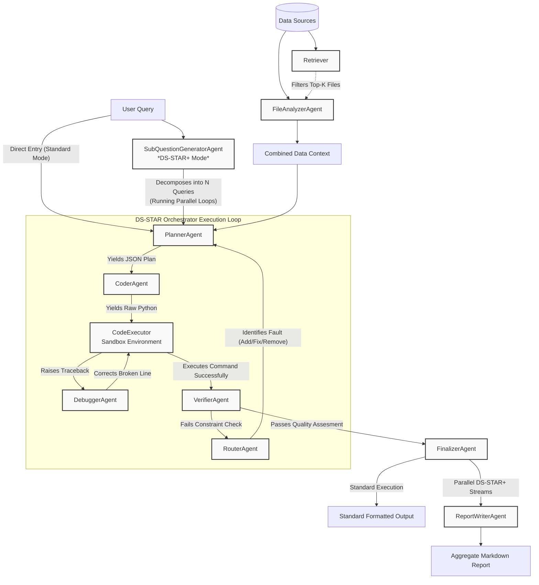

# DS-STAR Agent Framework

## Definition of an Agent
In the Agentloop codebase, an **agent** refers to an autonomous processing node dedicated to a specific logical phase of the Data Science lifecycle. Functionally, agents are instances that wrap LLM API calls (using specific NVIDIA NIM tier configurations such as `NIM_MODEL_PRO` or `NIM_MODEL_FLASH`) inside rigorous Pydantic-enforced generation loops (`.with_structured_output()`). This strict schema compliance ensures reliable hand-offs between separate nodes governed by the `DsStarOrchestrator`. Each agent acts in isolation, evaluating state context or telemetry (such as stack tracebacks from the execution sandbox) to execute distinct programmatic tasks.

## Agents List
The Agentloop orchestration relies on the following dedicated agents. Click the hyperlinks for detailed descriptions of each agent's active model, local tools, orchestration function, and deployment patterns strictly relevant to this codebase.

* **[FileAnalyzerAgent](./file_analyzer_agent.md)** - Translates unstructured datastores into schema and analytical contexts to be ingested by the system.
* **[Retriever](./retriever.md)** - Intercepts massive corpora using local `sentence-transformers` vector math to gate and filter irrelevant files out of context bounds.
* **[PlannerAgent](./planner_agent.md)** - Consumes processed data and constructs mutable, 12-step logical mappings bridging a query with runtime resolution.
* **[CoderAgent](./coder_agent.md)** - Evaluates logic branches against the environment bounds and emits runnable, accumulative Python scripts natively. 
* **[CodeExecutor](./code_executor.md)** - Technically an LLM-free node representing the isolated Docker or subprocess sandboxing environment that executes scripts and extracts artifacts.
* **[DebuggerAgent](./debugger_agent.md)** - Targets execution tracebacks natively and applies surgical fixes locally to the running block without erasing broader working patterns.
* **[VerifierAgent](./verifier_agent.md)** - Compares evaluated output bounds mechanically against initial planner intent to pass or flag execution outputs.
* **[RouterAgent](./router_agent.md)** - Corrects failed pipeline branches by instructing the Planner to Add, Fix, or Prune erroneous steps.
* **[FinalizerAgent](./finalizer_agent.md)** - Converts unstructured terminal output success states into cleanly formatted user-facing summaries.
* **[SubQuestionGeneratorAgent](./subquestion_generator_agent.md)** - Exclusive to `DS-STAR+` operation modes. Maps complex instructions to atomic multi-step execution graphs.
* **[ReportWriterAgent](./report_writer_agent.md)** - The final synthesis phase of `DS-STAR+`. Condenses concurrent parallel multi-agent trees into cohesive citation-backed documents.

## Agent Workflow Architecture
The core system leverages nested cyclic reasoning and sandbox executions mapping the pipeline lifecycle below:

